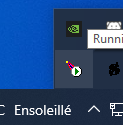

# Notes de cours

Ceci peut servir aux étudiants.

## Activer l'affichage des erreurs PHP

Ouvrir le fichier `C:\PHP\php.ini`

Et modifier la ligne 482 pour : 
````
display_errors = On
````

Puis, redémarrer Apache. En bas à droite, trouver cet icône, cliquer sur "Restart".

